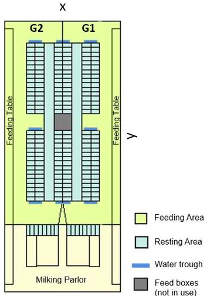
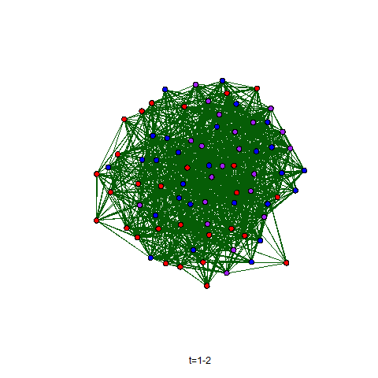
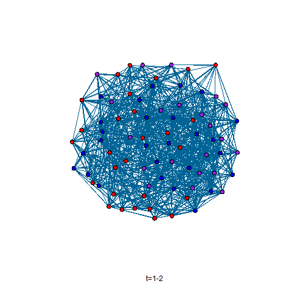

```{=html}
<style>
body {
  text-align: justify}
</style>
```
```{r, include=FALSE}
knitr::knit_hooks$set(output = function(x, options){
  if(!is.null(options$max_height)){
    paste('<pre style = "max-height:', options$max_height, '; float: left; width: 910px; overflow-y: auto;">', x, "</pre>", sep = "")
  }else{x}
})
```

## Introduction

The present tutorial replicates the analysis performed by [Marina et al.
(2023)](https://doi.org/10.3168/jds.2023-23483). We will analyse
information from a Swedish commercial dairy farm. The farm has installed
an ultra-wideband based Real-Time Location System (RTLS) that provides
the location of all the cows on the farm. Lactating cows were equipped
with a tag attached to their collars. Using the position information of
the cows, we can estimate daily spatial interaction networks and study
how cow characteristics affect the network structure.

1.  [Farm information](#fi)
2.  [Animal information](#ai)
3.  [Social contact information](#sci)
4.  [Build the networks](#btn)
5.  [Represent social networks](#rsn)
6.  [Analysing social networks](#asn)
7.  [Representing stERGM estimates](#rse)

#### Required packages

```{r, echo=TRUE, results='hide', message=FALSE, warning=FALSE}
library(statnet)
library(texreg)
library(reshape2)
library(ndtv) 
library(forcats)
library(ggplot2)
```

## Farm information {#fi}

Position data was collected from a Swedish commercial dairy farm. This
farm housed around 210 lactating dairy cows (Holstein, Red Dairy Cattle,
and Crossbred) in a non-insulated free-stall barn (Figure 1). The farm
is divided into two milking groups: early (G1) and late (G2) lactation
groups. We defined two functional areas within the barn: the resting
area consisting of the cubicles and the inner alleys and the feeding
area composed of the alleys beside the feeding tables and outer alleys.
Further information about the farm can be found in [Hansson et al.
(2023)](https://doi.org/10.3168/JDS.2022-21915).

{fig.size="50%"}

**Figure 1**. Schematic map of the free-stall barn under study (74 ×
33m), where y and x represent the direction of the y- and x-axis. The
farm is divided into two milking groups: early (G1) and late (G2)
lactation groups. The cubicles are in the central parts of the barn and
the feeding tables along both sides. The beige area is outside the
boundaries of the cows in the milking group, except for transport
between the pen area and the milking parlor.

## Animal information {#ai}

First, we read the information about the cows in the late lactation
group at this Swedish dairy farm. Cow information contains:

-   `Phenotypes_LateLactationGroup.csv`: Contains cows' individual
    information fitted in the separable temporal Exponential Random
    Graph Model (stERGM).
    -   *ID*: Identification number for the social network matrices.\
    -   *Parity*: Number of current lactation.
    -   *Lactation_stage*: Stage of lactation [Early (7- 49 Days in
        Milk), Mid (50 -179 DIM) or Late (≥180 DIM)].
    -   *Pregnancy_status*: Stage of pregnancy (0: Open, 1: Pregnant).
    -   *Breed*: Breed of each cow (HOL: Holstein, RDC: Red Dairy Cattle
        or CROSS: Crossbreed).
    -   *Claw_health*: Status of claw (0: Healthy, 1: Minor or mayor
        lesions).
    -   *Time_in_area*: Proportion of time each animal spent per day in
        the feeding area by dividing it by the total time reported by
        the RTLS.
    -   *Lactation_group*: Late lactation group was mainly composed of
        mid to late-lactation.

```{r}
Pheno=read.table("../data/raw/Phenotypes_LateLactationGroup.csv", header = TRUE, sep = ",")
```

-   `AGEcontemporary_LateLactationGroup.csv`: Contains the kindergarten
    effect matrix (`AGEcont`). The kindergarten effect, or contemporary
    age, represents animals born within seven days in the same farm
    being equal to 1, if two cows were contemporary, and 0 otherwise.

```{r}
AGEcont=as.matrix(read.table("../data/raw/Relationshipdata/AGEcontemporary_LateLactationGroup.csv", header = FALSE, sep = ","))
colnames(AGEcont)=rownames(AGEcont)=c(1:ncol(AGEcont))
```

-   `DIMcontemporary_LateLactationGroup.csv`: Contains the lactational
    effect matrix (`DIMcont`). The lactational effect, or contemporary
    DIM, represents cows that calved within seven days being equal to 1,
    if two cows were contemporary, and 0 otherwise.

```{r}
DIMcont=as.matrix(read.table("../data/raw/Relationshipdata/DIMcontemporary_LateLactationGroup.csv", header = FALSE, sep = ","))
colnames(DIMcont)=rownames(DIMcont)=c(1:ncol(DIMcont))
```

-   `PEDcontemporary_LateLactationGroup.csv`: Contains the additive
    relationship matrix (`PEDmat`). The relationship coefficients were
    calculated from the pedigree.

```{r}
PEDmat=as.matrix(read.table("../data/raw/Relationshipdata/PEDrelation_LateLactationGroup.csv", header = FALSE, sep = ","))
colnames(PEDmat)=rownames(PEDmat)=c(1:ncol(PEDmat))
```

*The kindergarten and lactational effect contained a total of 31 animals
and 135 contemporary relationships, respectively. The additive
relationship matrix contained eight pair of animals with with a
relationship coefficient higher than 0.5, indicating a
parental-offspring filial relationship.*

## Social contact information {#sci}

The position data automatically collected with the ultra-wideband RTLS
with a one-second fixed rate were used to estimate the distance among
the 76 lactating cows held in the late lactation group. We assumed that
a pair of cows interacted socially when they spent more than 10 minutes
per day at a minimum distance of 2.5 m. Interaction matrices, known as
adjacency matrices in graph theory terminology, were computed
independently for each functional area ("FeedingArea","RestingArea") and
each day (i.e., 24 h) of the 14 days considered in this study. Data from
the adjacency matrices is coded in a binary format, where 1's denote the
occurrence of a contact, and 0's indicate that no contact longer than 10
minutes was registered during the day. Following, we read the social
contact information for the cows held the late lactation group within
each functional area and per day.

```{r}
functionalarea=c("FeedingArea","RestingArea") # Functional areas
ADJmat=list()
for (i in functionalarea){
  for (day in c(1:14)){
      ADJmat[[i]][[day]]=as.matrix(read.table(
        paste0("../data/raw/Interactiondata/Adjacencymatrix_",i,"_LateLactationGroup_day",day,".csv"), header = FALSE, sep = ","))
    rownames(ADJmat[[i]][[day]])=c(1:nrow(ADJmat[[i]][[day]]))
    colnames(ADJmat[[i]][[day]])=c(1:ncol(ADJmat[[i]][[day]]))
  }
}
```

## Build the networks {#btn}

We will transform the adjacency matrices information into undirected
graphs using the `network` package.

```{r}
ADJGraph=list()
for (i in functionalarea){
  for (day in c(1:14)){
    ADJGraph[[i]][[day]]=network::network(as.matrix(ADJmat[[i]][[day]]),directed=FALSE)
  }
}
```

Save list of networks as dynamic network objects for each functional
area, independently.

```{r, echo=TRUE, results='hide', message=FALSE, warning=FALSE}
DynamicGraph=list()
for (i in functionalarea){
  DynamicGraph[[i]] = networkDynamic(network.list = ADJGraph[[i]], start = 1, end = 14)
}
```

## Represent social networks {#rsn}

Daily social networks can be represented as sociograms. Sociograms are
composed of nodes representing cows, and the social contacts between any
two cows were represented as the presence or absence of an edge linking
the nodes. The colors of the nodes represent the parity number: red (1),
blue (2) and purple (3+).

```{r}
node_colors=as.character(Pheno$Parity)
node_colors=ifelse(node_colors=="1","purple",ifelse(node_colors=="2","blue","red"))
```

Size of the nodes will be based on the number of social contact
established on that day, known as degree in graph theory terminology.
Degree will be estimated using the `sna`package.

```{r}
FA_degree=sna::degree(ADJGraph[["FeedingArea"]][[1]], gmode="graph")
RA_degree=sna::degree(ADJGraph[["RestingArea"]][[1]], gmode="graph")
```

::: columns
::: {.column width="50%"}
```{r}
plot.network(ADJGraph[["FeedingArea"]][[1]],
             vertex.col = node_colors,
             vertex.cex = ((FA_degree)/max(FA_degree))*3,
             edge.col = "#065d06")
```
:::

::: {.column width="50%"}
```{r}
plot.network(ADJGraph[["RestingArea"]][[1]],
             vertex.col = node_colors,
             vertex.cex = ((RA_degree)/max(RA_degree))*3,
             edge.col = "#016496")
```
:::
:::

In addition, dynamic networks can be represented as animations. In this
tutorial, each transition represents the changes occurred between daily
networks.

::: columns
::: {.column width="50%"}
```{r, eval=FALSE}
saveGIF({render.animation(DynamicGraph[["FeedingArea"]],
                            displaylabels=F,
                            vertex.col=node_colors,
                            edge.col="#065d06",
                            render.cache='none')},
        movie.name=paste0("Figure2_FA.gif"))
```


:::

::: {.column width="50%"}
```{r, eval=FALSE}
saveGIF({render.animation(DynamicGraph[["RestingArea"]],
                          displaylabels=F,
                          vertex.col=node_colors,
                          edge.col="#016496",
                          render.cache='none')},
        movie.name=paste0("Figure2_RA.gif")) 
```


:::
:::

## Analyzing social networks {#asn}

With the aim of assessing the role of the cows' characteristics,
included in `Pheno` dataframe, on the likelihood of establishing social
interactions, we will implement the information from the social networks
into the `statnet` package. We will apply the separable temporal
exponential-family random graph model (stERGM), described by [Krivitsky
and Handcock (2010)](https://doi.org/10.1111/rssb.12014), to explore the
evolution of social networks over the 14 days considered in this
tutorial. To this aim, we will include the cows' information into the
dynamic networks.

```{r}
for (i in functionalarea){
  DynamicGraph[[i]] %v% "Parity"          = as.character(Pheno$Parity)
  DynamicGraph[[i]] %v% "Pregnancy_status"= as.character(Pheno$Pregnancy_status)
  DynamicGraph[[i]] %v% "Lactation_stage" = as.character(Pheno$Lactation_stage)
  DynamicGraph[[i]] %v% "Breed"           = as.character(Pheno$Breed)
  DynamicGraph[[i]] %v% "Claw_health"     = as.character(Pheno$Claw_health)
  DynamicGraph[[i]] %v% "Time_in_area"    = as.numeric(  Pheno$Time_in_area)
}
```

Likewise, we will implement in the model the kindergarten and
lactational effect, and the relationship coefficient to assess the
effect of having shared early life experiences, or in the last drying
period together, or sharing a filial relationship into the likelihood of
establishing social contacts.

```{r}
AGEGraph=network::network(AGEcont, directed=FALSE)
DIMGraph=network::network(DIMcont, directed=FALSE)
PEDGraph=network::network(matrix(1,ncol(PEDmat),ncol(PEDmat)), directed=FALSE)

A=reshape2::melt(PEDmat)
A=A[A$Var1<A$Var2,]
A=A[order(A$Var1,A$Var2),]
network::set.edge.attribute(PEDGraph, "PEDGraph",A[,3])
```

The fitted stERGM consists of two fitted logistic regressions, one for
the formation part of the model, and one for the persistence part of the
model. Each model includes an intercept, five node factor effects, five
node match effects, one node covariable and three edge covariables.
Therefore, for each of the fitted variables we will obtain two
estimates, one for the formation effect and one for the persistence
effect.

```{r, error=FALSE, warning=FALSE, message=FALSE}
stERGMestimates=list()
for (i in functionalarea){
  stERGMestimates[[i]] = stergm(DynamicGraph[[i]],
                formation   = ~ edges  + 
                              nodefactor("Parity")           + nodematch("Parity")            + 
                              nodefactor("Pregnancy_status") + nodematch("Pregnancy_status")  + 
                              nodefactor("Lactation_stage")  + nodematch("Lactation_stage")   + 
                              nodefactor("Breed")            + nodematch("Breed")             +  
                              nodefactor("Claw_health")      + nodematch("Claw_health")       + 
                              nodecov("Time_in_area")        +
                              edgecov(AGEGraph, attrname=NULL) + 
                              edgecov(DIMGraph, attrname=NULL) + 
                              edgecov(PEDGraph, "PEDGraph"),
                dissolution = ~ edges  + 
                              nodefactor("Parity")           + nodematch("Parity")            + 
                              nodefactor("Pregnancy_status") + nodematch("Pregnancy_status")  + 
                              nodefactor("Lactation_stage")  + nodematch("Lactation_stage")   + 
                              nodefactor("Breed")            + nodematch("Breed")             +  
                              nodefactor("Claw_health")      + nodematch("Claw_health")       + 
                              nodecov("Time_in_area")        +
                              edgecov(AGEGraph, attrname=NULL) + 
                              edgecov(DIMGraph, attrname=NULL) + 
                              edgecov(PEDGraph, "PEDGraph"),
                estimate = "CMLE",
                times=1:14)
}
```

## Representing stERGM estimates {#rse}

Below are the estimates of formation and persistence obtained by
implementing stERGM for the feeding area and for the resting area.
Presenting the estimates together helps us to get an idea of the
importance of each cow's characteristic for the establishment of social
contacts.

```{r max_height = "500px"}
texreg::screenreg(stERGMestimates, custom.model.names = functionalarea)
```

**Table S2**. Formation and persistence conditional log-odds ratios
estimated through the stERGM implementation. The standard error is shown
between brackets (\* p \< 0.05; \*\* p \< 0.01; \*\*\* p \< 0.001).

However, a figure makes it easier to read and compare the stERGM
estimates. Therefore, the following code will focus on presenting these
results in the same figure. First, we will extract the estimates of
formation and persistence into tables.

```{r}
Feed.df=as.data.frame(summary(stERGMestimates[[1]])$coef)
Rest.df=as.data.frame(summary(stERGMestimates[[2]])$coef)

colnames(Feed.df)=c("Estimates","SE","MCMC %","z.value","p.value")
colnames(Rest.df)=c("Estimates","SE","MCMC %","z.value","p.value")
```

Following, we will standardize the names of the estimates following
[Marina et al. (2023)](https://doi.org/10.3168/jds.2023-23483).

```{r}
rowN=c("edges","factor(Parity: 2)","factor(Parity: 3+)","match(Parity)",
       "factor(Pregnancy status: Pregnant)","match(Pregnancy status)",
       "factor(Lactation stage: Middle)","match(Lactation stage)",
       "factor(Breed: Holstein)","factor(Breed: Red dairy cattle)","match(Breed)",
       "factor(Claw health: Remark)","match(Claw health)",
       "covariable(Time in area)", "covariable(Agecont)","covariable(DIMcont)","covariable(REL)")
Feed.df$FixedEffects=rep(rowN,2)
Rest.df$FixedEffects=rep(rowN,2)
```

Include model information Include model information in the dataframes.

```{r}
Feed.df$Model=c(rep("Formation",17),rep("Persistence",17))
Rest.df$Model=c(rep("Formation",17),rep("Persistence",17))
```

Filtering the estimates for `edges` and `Time in area`. Time in area
corrects the probability of an existing edge by the time spent in the
functional area. Therefore, the inclusion of this covariate is
imperative, as the more time the animals spend in each functional area,
the greater the likelihood of random interactions.

```{r}
Feed.df=Feed.df[!grepl("edges",        Feed.df$FixedEffects), ]
Feed.df=Feed.df[!grepl("Time in area", Feed.df$FixedEffects), ]
Rest.df=Rest.df[!grepl("edges",        Rest.df$FixedEffects), ]
Rest.df=Rest.df[!grepl("Time in area", Rest.df$FixedEffects), ]
```

Order the fixed effects included in the model following [Marina et al.
(2023)](https://doi.org/10.3168/jds.2023-23483).

```{r}
FFlevels=c(Feed.df$FixedEffects[15:1])
Feed.df$FixedEffects=factor(Feed.df$FixedEffects, levels = FFlevels)
Feed.df$Model=       factor(Feed.df$Model, levels=c("Formation","Persistence"))
Feed.df$Model=       forcats::fct_relevel(Feed.df$Model, c("Formation","Persistence"))
Rest.df$FixedEffects=factor(Rest.df$FixedEffects, levels = FFlevels)
Feed.df$Model=       factor(Rest.df$Model, levels=c("Formation","Persistence"))
Rest.df$Model=       forcats::fct_relevel(Rest.df$Model, c("Formation","Persistence"))
```

Set colors for formation and persistence estimates in the feeding
(green) and resting (blue) areas.

```{r}
Colors=list()
Colors[[1]]=c("#0A960A","#065d06")
Colors[[2]]=c("#0080c1","#016496")
```

Determine the percentage confidence interval of the estimates. The
figure will represent the 95% confidence interval.

```{r}
ConfInt=1.96 
```

Now we are ready to depict the formation and persistence log-odds ratios
estimated through the separable temporal exponential random graph models
(stERGM):

::: columns
::: {.column width="50%"}
```{r message=FALSE, warning=FALSE}
ggplot(Feed.df,aes(x = FixedEffects, y = Estimates, col=as.factor(Model))) +
  geom_hline(yintercept = 0,linetype = "dotted") +
  geom_point(aes(shape = Model),size=2.2, position = position_dodge(width = 0.7)) +
  geom_errorbar(aes(ymin = Estimates - (SE * ConfInt), ymax = Estimates + (SE * ConfInt), linetype = ifelse(Feed.df$Model=="Formation", "dashed", "solid")),  width = 0.5, colour = "black", alpha = 1.0, size = 0.5, position = position_dodge(width = 0.7), show.legend = FALSE) +
  scale_color_manual(values = c(Colors[[1]][2], Colors[[1]][1])) +
  theme_light() + theme(legend.position = "none", axis.text.y = element_text(size = 12))+
  coord_flip() + scale_x_discrete(labels = FFlevels) + 
  ylim(-1.25,2) + xlab("") + ylab("") + ggtitle("Feeding area")
```
:::

::: {.column width="50%"}
```{r message=FALSE, warning=FALSE}
ggplot(Rest.df,aes(x = FixedEffects, y = Estimates, col=Model)) +
  geom_hline(yintercept = 0,linetype = "dotted") +
  geom_point(aes(shape = Model),size=2.2, position = position_dodge(width = 0.7)) +
  geom_errorbar(aes(ymin = Estimates - (SE * ConfInt), ymax = Estimates + (SE * ConfInt), linetype = ifelse(Rest.df$Model=="Formation", "dashed", "solid")), width = 0.5, colour = "black", alpha = 1.0, size = 0.5, position = position_dodge(width = 0.7), show.legend = FALSE) +
  scale_color_manual(values = c(Colors[[2]][2], Colors[[2]][1])) +
  theme_light() + theme(legend.position = "none", axis.text.y = element_text(size = 12))+
  coord_flip() + scale_x_discrete(labels = FFlevels) + 
  ylim(-1.25,2) + xlab("") + ylab("") + ggtitle("Resting area")
```
:::
:::

**Figure 3**. Formation and persistence log-odds ratios estimated
through the separable temporal exponential random graph models (stERGM).
Formation estimates are depicted by light green and blue triangles for
the feeding and resting areas, respectively. Persistence estimates are
represented by dark green and blue circles for the feeding and resting
areas, respectively. Error bars represent the estimates 95% confidence
intervals. The model included the following terms: i) factor: sum of the
node values for all existing edges in the network; ii) match: number of
edges in which the value between the nodes (i, j) is the equivalent;
iii) covariable: sum of the node value for all existing edges in the
network; iv) edge covariable: value for each edge appearing in the
network. Agecont represents pairs of animals born within 7 days of each
other. DIMcont corresponds to pairs of animals calved within 7 days of
each other. REL stands for the relationship matrix based on pedigree
records.

### Citation and contact information

I hope this has been useful. If you use information from external
sources, make sure to cite them properly:

> Marina, H., Ren, K., Hansson, I., Fikse, F., Nielsen, P.P., Rönnegård,
> L., 2023. New insight into social relationships in dairy cows, and how
> time of birth, parity and relatedness affect spatial interactions
> later in life. J. Dairy Sci. <https://doi.org/10.3168/JDS.2023-23483>

For any questions or further information, please contact the authors:

-   [Hector Marina](https://www.slu.se/en/ew-cv/hector-marina/)
    ([hector.marina\@slu.se](mailto:hector.marina@slu.se){.email})

-   [Keni Ren](https://www.slu.se/en/ew-cv/keni-ren/)
    ([keni.ren\@slu.se](mailto:keni.ren@umu.se){.email})

-   [Ida Hansson](https://www.slu.se/en/ew-cv/hector-marina/)
    ([ida.hansson\@slu.se](mailto:ida.hansson@slu.se){.email})

-   [Freddy
    Fikse](https://www.vxa.se/toppmeny/kontakter/uppsala/freddy-fikse/)
    ([freddy.fikse\@vxa.se](mailto:freddy.fikse@vxa.se){.email})

-   [Per Peetz Nielsen](https://www.ri.se/sv/person/per-peetz-nielsen)
    ([per.peetz.nielsen\@ri.se](mailto:per.peetz.nielsen@ri.se){.email})

-   [Lars Rönnegård](https://www.slu.se/cv/lars-ronnegard/)
    ([lars.ronnegard\@slu.se](mailto:lars.ronnegard@slu.se){.email})
